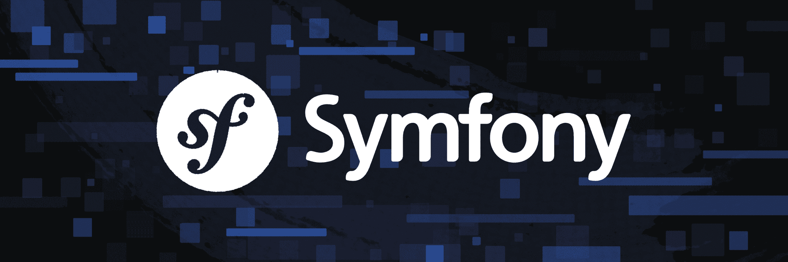

# Mitt Projekt



Detta är min hemsida för kursen objektorienterade webbteknologier.

Den kommer att byggas på under kursens gång.

## Installation

För att komma igång att köra projektet, följ dessa steg:

1. Klona repo

```sh
    git clone https://github.com/Zlyde/mvc-report
```

2. Installera beroenden

```sh
    cd mvc-report
    npm install
```

3. Starta applikationen

Du kan köra projektet lokalt med hjälp av PHP's inbyggda webbserver:

```sh
    php -S localhost:8888 -t public
```
